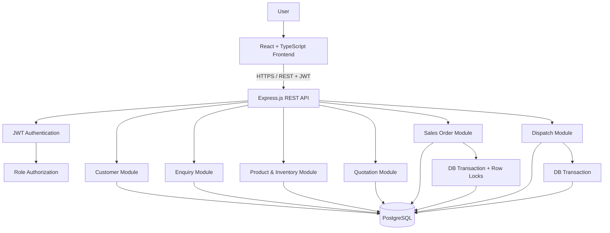
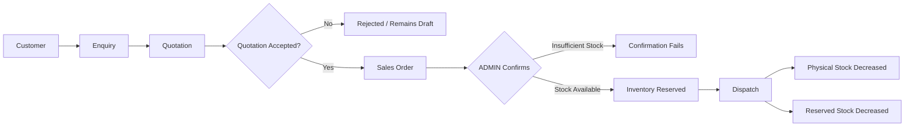
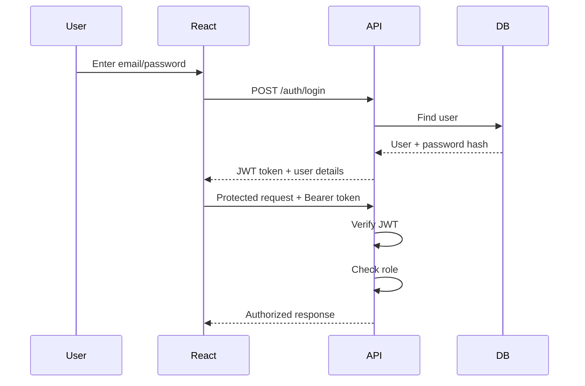
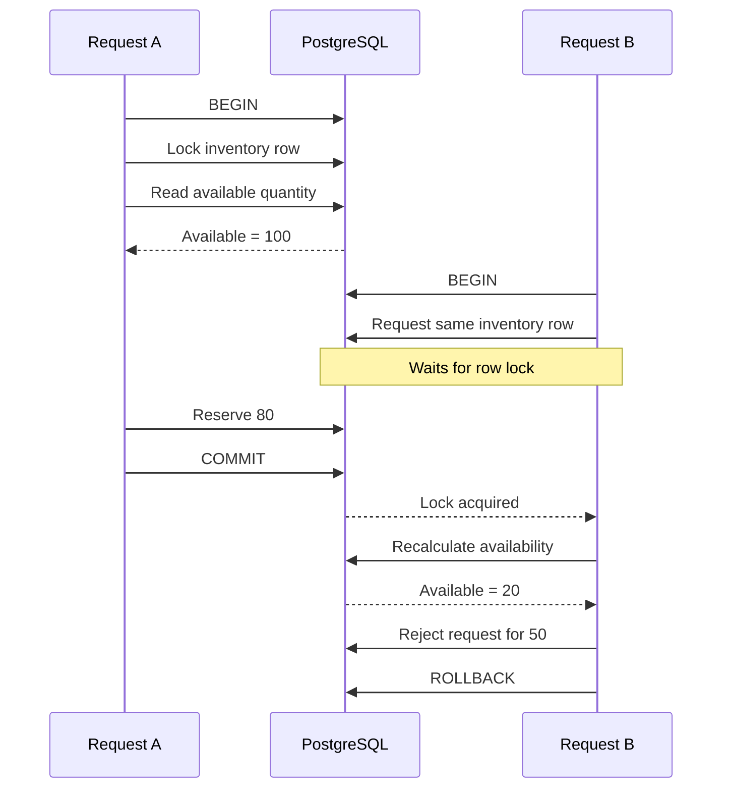

# FundsRoom ERP — System Architecture

## 1. Architecture Overview

FundsRoom ERP is implemented as a layered full-stack web application using the PERN stack:

- **Frontend:** React + TypeScript
- **Backend:** Node.js + Express.js
- **Database:** PostgreSQL
- **Authentication:** JWT
- **Authorization:** Role-Based Access Control
- **Validation:** Express Validator + backend business validation
- **Testing:** Jest + Supertest
- **Security middleware:** Helmet + CORS + rate limiting

The architecture intentionally keeps business rules in the backend so that the React client cannot bypass workflow or inventory constraints.

---

## 2. High-Level Architecture



---

## 3. Business Workflow

The application models the complete order-processing lifecycle:



The backend controls each transition.

---

# 4. Application Layers

## Presentation Layer

**React + TypeScript**

Responsibilities:

- Login
- Customer management
- Enquiry creation/view
- Quotation creation and status management
- Sales Order visibility
- Inventory visibility
- Dispatch UI
- Session/token handling

The frontend does not own critical business rules.

For example, the frontend may display:

```text
Available = Physical - Reserved
```

but the backend independently calculates and validates availability before accepting an inventory-sensitive operation.

---

## API Layer

**Express.js**

Responsibilities:

- HTTP routing
- Request parsing
- Authentication middleware
- Role middleware
- Request validation
- Controller orchestration
- HTTP status/error responses

Typical structure:

```text
Route
  ↓
Middleware
  ↓
Controller
  ↓
Service
  ↓
PostgreSQL
```

---

## Business Logic Layer

The service modules contain workflow rules.

```text
auth/
customer/
enquiry/
product/
quotation/
salesOrder/
dispatch/
```

Examples:

- quotation amount calculation
- quotation status transitions
- accepted quotation conversion
- duplicate Sales Order prevention
- inventory availability validation
- inventory reservation
- dispatch eligibility
- physical/reserved stock updates

This separation keeps controllers thin and makes business rules testable.

---

## Data Layer

**PostgreSQL**

The application uses normalized relational tables rather than storing the complete workflow as JSON.

Core entities:

```text
users
customers
products
inventory
enquiries
enquiry_items
quotations
quotation_items
sales_orders
sales_order_items
dispatches
dispatch_items
```

Foreign keys maintain relationships between workflow stages.

---

# 5. Authentication & Authorization

## Authentication flow



Passwords are stored as hashes rather than plaintext passwords.

JWT provides authenticated identity for protected requests.

RBAC then determines whether the authenticated user can perform the requested operation.

---

# 6. Why Backend Authorization Matters

Frontend restrictions are not sufficient for security.

A user could bypass:

```text
React UI
```

and directly call:

```text
POST /api/sales-orders/:id/confirm
```

Therefore the API checks the authenticated user's role before executing restricted operations.

Example:

```text
SALES_USER
    ↓
POST /sales-orders/:id/confirm
    ↓
Role middleware
    ↓
403 Forbidden
```

---

# 7. Inventory Design

Inventory is represented using:

```text
Physical Quantity
Reserved Quantity
```

Available stock is derived:

```text
Available = Physical - Reserved
```

This avoids storing a third independently mutable quantity that can become inconsistent.

### Reservation

Reservation changes only `reserved_quantity`:

```text
Before
Physical = 100
Reserved = 30
Available = 70

Reserve 20

After
Physical = 100
Reserved = 50
Available = 50
```

### Dispatch

Dispatch changes both:

```text
Physical -= quantity
Reserved -= quantity
```

Example:

```text
Before
Physical = 100
Reserved = 10

Dispatch 10

After
Physical = 90
Reserved = 0
```

---

# 8. Concurrency-Safe Reservation

Inventory reservation is one of the most important technical areas of the case study.

A frontend availability check alone is unsafe:

```text
Request A sees available = 100
Request B sees available = 100

A requests 80
B requests 50

Both appear valid
80 + 50 = 130  > 100
```

The backend therefore uses a database transaction and locks the relevant inventory rows before checking and updating them.



This makes the database the authority for inventory consistency.

---

# 9. Sales Order Integrity

A Sales Order can only originate from an accepted quotation.

```text
DRAFT quotation
    ↓
Cannot convert

REJECTED quotation
    ↓
Cannot convert

ACCEPTED quotation
    ↓
Can convert
```

Additionally, the quotation-to-Sales-Order relationship is uniquely constrained so the same quotation cannot generate multiple Sales Orders.

This protects both application logic and database integrity.

---

# 10. Quotation Calculation

The backend calculates quotation totals.

For each line:

```text
Gross = Quantity × Unit Price

Discount = Gross × Discount %

Taxable Amount = Gross - Discount

GST = Taxable Amount × GST %

Line Amount = Taxable Amount + GST
```

The quotation total is derived from these server-side calculations.

This prevents a manipulated frontend request from directly controlling the final commercial amount.

---

# 11. Transaction Strategy

Transactions are used wherever a business operation contains multiple dependent database changes.

| Operation | Transaction |
|---|:---:|
| Create enquiry + items | ✓ |
| Create quotation + items | ✓ |
| Sales Order conversion | ✓ |
| Sales Order confirmation + reservation | ✓ |
| Dispatch + inventory update | ✓ |

The design objective is:

```text
Either the complete business operation succeeds
OR
none of its dependent changes are committed.
```

---

# 12. Dispatch Integrity

Dispatch is allowed only for an eligible Sales Order.

The backend validates:

```text
Sales Order exists
        +
Status is CONFIRMED
        +
Order is not cancelled
        +
Dispatch quantity <= reserved quantity
        +
No duplicate dispatch
```

Then the transaction writes the dispatch record and decreases inventory.

---

# 13. Database Integrity

The PostgreSQL schema provides multiple layers of protection:

### Primary keys

Every main entity has a stable identifier.

### Foreign keys

Relationships such as:

```text
quotation → enquiry
sales_order → quotation
dispatch → sales_order
inventory → product
```

are enforced by the database.

### Unique constraints

Important uniqueness includes:

```text
User email
Product code
Quotation relationship to Sales Order
```

### Check constraints

Inventory and quantity rules are protected at database level where appropriate, including preventing invalid reserved/physical quantities.

---

# 14. Error Handling

The API uses centralized error handling so unexpected failures return a controlled response rather than an unhandled server crash.

The application also uses:

- request/body validation
- authentication checks
- role checks
- resource existence checks
- business-rule validation
- database transactions

---

# 15. Security Controls

Implemented security measures include:

```text
Password hashing
JWT authentication
Backend RBAC
CORS configuration
Helmet security headers
API rate limiting
Environment-based configuration
```

Secrets such as database credentials and JWT configuration belong in `.env` and are excluded from source control.

---

# 16. Frontend ↔ Backend Responsibility

| Concern | Frontend | Backend |
|---|:---:|:---:|
| Form validation | ✓ | ✓ |
| Display available stock | ✓ | ✓ |
| Authentication UI | ✓ | ✓ |
| Role-based visibility | ✓ | ✓ |
| Role enforcement | — | ✓ |
| Quotation calculation authority | — | ✓ |
| Inventory availability authority | — | ✓ |
| Transactions | — | ✓ |
| Database integrity | — | ✓ |

The guiding principle is:

> **The frontend improves the user experience; the backend protects the business.**

---

# 17. Request Lifecycle

A typical protected request follows:

```text
Browser
  ↓
React API client
  ↓
HTTP request
  ↓
Rate limiter
  ↓
JWT authentication
  ↓
Role authorization
  ↓
Route validation
  ↓
Controller
  ↓
Service/business logic
  ↓
PostgreSQL transaction (where required)
  ↓
Response
  ↓
React UI update
```

---

# 18. Project Structure

```text
fundsroom-erp/
├── backend/
│   ├── src/
│   │   ├── config/
│   │   ├── db/
│   │   │   ├── migrations/
│   │   │   └── seeds/
│   │   ├── middleware/
│   │   ├── modules/
│   │   │   ├── auth/
│   │   │   ├── customer/
│   │   │   ├── dispatch/
│   │   │   ├── enquiry/
│   │   │   ├── product/
│   │   │   ├── quotation/
│   │   │   └── salesOrder/
│   │   └── utils/
│   └── tests/
│
├── frontend/
│   └── src/
│
├── docs/
│   ├── API-DOCUMENTATION.md
│   └── SYSTEM-ARCHITECTURE.md
│
└── README.md
```

---

# 19. Design Priorities

The implementation prioritizes:

1. **Correct business workflow**
2. **Database consistency**
3. **Backend authorization**
4. **Transaction safety**
5. **Server-side commercial calculations**
6. **Clear separation of responsibilities**
7. **Simple, functional UI**

The case study explicitly values correctness and workflow integrity over visual complexity, so engineering effort is concentrated on the backend and data model rather than an oversized dashboard.

---

# 20. Interview Discussion Points

The architecture can be defended through the following technical decisions:

### Why PostgreSQL?

The workflow contains strongly related entities, foreign-key relationships, unique constraints, and transaction-sensitive inventory operations, making a relational database a natural fit.

### Why calculate quotation totals on the backend?

The browser is an untrusted client. Financial/business calculations should be validated by the server.

### Why row locking?

A normal read-then-update flow can race under concurrent requests. Locking the inventory row makes reservation decisions serializable for the affected stock record.

### Why derive available quantity?

Maintaining only physical and reserved quantities avoids a third mutable value that could drift from the source values.

### Why enforce RBAC on the backend?

UI controls can be bypassed. API authorization must therefore be enforced independently.

### Why use transactions?

Reservation and dispatch modify multiple related records. A partial update would leave the ERP in an inconsistent state.

---

# 21. Future Extensions

The current architecture can be extended without redesigning the complete system for features such as:

- Sales Order cancellation with reservation release
- Partial dispatch
- DAMAGED stock tracking
- Audit logging
- Pagination and advanced filtering
- Swagger/OpenAPI generation
- Dockerized production deployment
- Observability and structured logging

These are intentionally separate from the mandatory core workflow.
